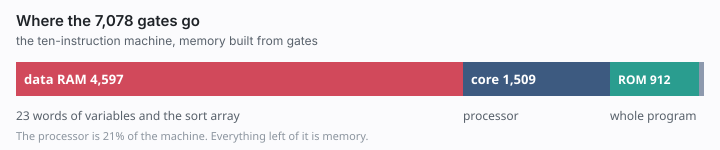

# One instruction is not cheaper than ten

There is a well-known toy in computer architecture called the one-instruction
set computer. The most famous version is SUBLEQ: subtract one memory word from
another, and branch if the result is not positive. That single operation is
Turing-complete. You can compile C to it. People build them on FPGAs for fun.

A natural question is whether that minimality also buys a smaller machine —
fewer gates in total, counting the memory as well as the processor. The answer
is no, and the reason turns out to have almost nothing to do with instruction
counts. What you get from reading it: measured gate counts for eleven machines
from one instruction to fourteen, the exchange rate between a word of memory
and a gate that decides all of it, and the one instruction group that turns out
to matter more than the other ten put together.

## What I measured, and how

**The question.** For a computer built entirely from logic gates, which
instruction set costs the fewest gates to run a realistic program?

**The cost model.** Everything is synthesised to 2-input NAND gates with Yosys
and counted, including the memory: a gate-built RAM word is flip-flops plus its
own write decoder and read multiplexer. Each flip-flop is normalised to a
six-NAND D type. No figure below is estimated unless it says so.

**The benchmark.** Five programs — Fibonacci, insertion sort of 16 words,
shift-and-add multiply, Euclid's GCD, binary-to-decimal — written once in a
small virtual instruction set and macro-expanded per machine, so every design
provably runs the same algorithm on the same data. Every design was simulated
against a golden model before a single gate was counted.

**The designs.** It began as a two-way contest: SUBLEQ against the smallest
conventional machine I could construct, a four-instruction accumulator with
load, store, subtract and branch-if-zero. SUBLEQ lost heavily, but for a reason
I had not expected, and chasing it widened the project into a sweep — five,
seven, ten, twelve and fourteen operations, plus two more exotic
one-instruction machines — all sharing one microarchitecture so the instruction
set is the only variable.

## 1. Memory is the machine

### The exchange rate

The first measurement reframed the question. Building a computer out of gates
means building its memory out of gates too, and the synthesised RAM works out
to about 196 NAND-equivalents per 16-bit word. (That is from a 136-word store;
`synth/gates_ram.sh` reproduces it for any size.)

The processor of that first four-instruction machine was 806 gates against
27,406 for the whole design — three percent. That machine wrote its results
into a 100-word array, which I later replaced with an output port precisely
because the array was swamping everything else, so treat 3% as the extreme end
of the range; in the leanest machine here the processor is 21%.

### What that implies

Either way you get an exchange rate, and the condition on it is the whole
story:
**so long as the program has to live in writable memory**, one word of program
costs about a quarter of that first core. Any instruction that removes program
words pays for itself almost immediately.

This is the opposite of the intuition that minimal instruction sets are cheap,
and it is why SUBLEQ loses in this implementation: three words per instruction,
five memory accesses each, and no comparison that leaves its operands intact,
so every `if` becomes a macro.

## 2. Where the minimum lies

### Two regimes, two answers

Where the minimum sits depends on where the program lives:

| instructions | program in writable RAM | program in ROM |
|---|---:|---:|
| 5 | 59,125 | not eligible |
| 7 | 49,477 | not eligible |
| 10 | 47,295 | **7,078** |
| 12 (adds two immediate forms) | **45,927** | 7,325 |
| 14 (adds AND, OR, XOR, shift) | 47,497 | 7,280 |

The original four-instruction set is absent because it cannot run the suite at
all: with only branch-if-zero and subtract there is no bounded-time way to
compare two numbers, so deciding `a < b` costs steps proportional to the values
themselves. It needs branch-on-sign before it can sort anything, which is why
the ladder starts at five.

### The rule, working

While the program must live in writable RAM, an instruction is worth adding if
it removes at least one word of program per 196 gates it costs. The
twelve-instruction variant is that rule in action: its two immediate forms cost
182 gates of core and remove eight words of program, worth 1,568 in RAM, so it
should come out about 1,386 ahead — measured, 1,368. In ROM those same eight
words are worth about 34, the same two instructions become a net loss, and the
minimum moves to ten. The fourteen-instruction variant loses in both columns
for a duller reason: the benchmark never executes its four logic instructions,
so they are 202 gates of decode for nothing. Hold that sentence lightly —
chapter 7 hands the same machines a workload that computes a checksum, and the
dead weight turns out to be mandatory.

That instructions reusing existing datapath are nearly free, while instructions
adding new datapath rarely pay, is qualitatively consistent with Sakamoto,
Ahmed, Anderson and Hara-Azumi's *Subleq⊖: An Area-Efficient
Two-Instruction-Set Computer*, where a second instruction reusing the existing
subtractor cost 1.33x area for a 2.78x speedup, while dedicated shifter and
multiplier variants cost 1.87x and 5.86x and ran slower in wall-clock terms.
Their ratios are core area only, which if anything makes the agreement more
interesting.

Note also that past the minimum the ROM column barely moves. "Turns back up" is
a 3.5% wobble there, not a cliff — and hold on to that condition about writable
RAM, because the next chapter removes it and takes the rule with it.

## 3. The thing that actually mattered

The curve turned out to be secondary. Sorted by gate count, the designs fall
into two groups with nothing in between:

| | gates | operations |
|---|---|---|
| cannot index without self-modifying code | 47,295 – 164,783 | 1–7 |


| can index without self-modifying code | 7,078 – 8,848 | 3–14 |

("Operations" means distinct primitive operations — opcodes plus memory-mapped
port behaviours — not instruction words. Chapter 5 explains why instruction
count is the wrong axis, and how a machine with one instruction sits at three
operations.)

Under the gate-built memory model, the cheapest design that cannot index is
6.7x larger than the cheapest that can. Inside the cheap group everything sits
within 25% of everything else across a range from three operations to fourteen,
and the spread there does not track instruction count either: the
fourteen-operation machine beats the twelve-operation one. Eligibility, by
contrast, is binary — a machine either never writes a program word or it does.

### Two ways to compute an address

None of these machines can express "element *i* of the array" in an
instruction, because the address field is a constant baked into the instruction
word. The address has to be computed somewhere. Without an index register you
compute it in software, and the only place to put the result is inside an
instruction:

```
    LDA tmpl
    ADD i
    STA P        ; overwrites the instruction below
P:  LDA 0        ; just rewritten
    STA d
```

With an index register, an 8-bit adder on the address path does it:

```
    LDX i
    LDAX ARR
    STA d
```

Five instructions become three, saving twelve words of program across the
benchmark — ten across its five indexed-access sites, plus two constant words
the self-modifying version needs as instruction templates.

### Why ~200 gates buy 37,951

Those twelve words are worth about 2,350 gates in RAM and about 50 in ROM, and
both figures matter. Priced as RAM, density alone repays the index register's
~200 gates roughly tenfold — and that is not a separate calculation from the
table above but the same one: twelve words at 196 gates less 198 of extra core
predicts 2,154, against a measured seven-to-ten difference of 2,182. A 28-gate
residual, so word count really is the whole story there.

So this is not an architectural feature that fails to pay its way. It is one
whose obvious payoff is an order of magnitude smaller than its real one — and
the real one is that the second version never writes to a program word. The
program becomes read-only, and read-only storage is a completely different
circuit: a ROM word is a few gates of decode-and-OR that synthesis shares
across hundreds of words. Averaged over this image, 4.3 gates per word against
196 for RAM, about 46x.

The controlled comparison is this. The same ten-instruction machine, running
the same program, costs **47,295 gates with its program in writable RAM and
9,344 with it in ROM** — nothing changed but where the code sits. The index
register is the only reason the second column exists at all. It does not save
those 37,951 gates; it makes them saveable. **The index register is not an
optimisation. It is a permission.**

(Moving the program's twelve read-only *constants* into ROM as well takes the
total to 7,078, which is where the headline figure comes from. That is a
memory-map decision available to any design, so it does not belong in the
comparison.)

This also retires the break-even rule from chapter 2. Once the program is in
ROM a word costs a few gates, not 196, so no plausible instruction removes
enough program to pay for its own decode logic. That is exactly why the cheap
group is so flat — with one exception, which chapter 7 comes to: an instruction
that removes code by the hundred rather than by the word.

### What this does not show

*The marginal word is not the average word.* 4.3 is the mean over this image.
The twelve-instruction variant has eight *fewer* program words yet costs 65
more gates outside its core, because synthesised ROM is priced by address
width, output width and content structure, not by word count.

*The argument is partly circular, by construction.* Once you grant that every
word a program writes must be full-price RAM, a self-modifying machine is
expensive almost by definition. The model makes it true *that*
self-modification costs; the measurements establish *how much*.

*The all-or-nothing program store is an assumption, and the one I would attack
first.* The addresses a self-modifying program patches are fixed at assembly
time — `P` above is a link-time constant — so the store could be split into ROM
plus a handful of individually decoded writable words, five of them for the
seven-instruction machine. At my own per-word figures that lands near 8,000
gates, inside the cheap group. I have not built it, and the last time I
reasoned about an unbuilt design here I got both its area and its timing wrong
in opposite directions, so treat it as a sketch. What survives regardless: the
index register removes the need for a writable window altogether, and 6.7x is
what the simple one-ROM-one-RAM map costs you for lacking it.

*The 46x is partly the technology.* Real SRAM is roughly six transistors per bit
rather than six gates, and mask ROM roughly one, so with real memory macros the
gap narrows substantially, though it does not invert. Those two figures are
rules of thumb, not outputs of this flow.

*The workload matters.* My suite sorts a 16-word array, so indexing is on the
critical path. A program that never touches an array, or one you are happy to
let rewrite itself, would move the boundary or erase it.

## 4. The best machine I designed

This is the machine I arrived at by hand, and the one the repository documents
in detail. Chapter 6 describes a smaller one, found by searching rather than by
designing, which beats it by 2.8%.

### The instruction set

Ten instructions, 16-bit words: `LDA`, `STA`, `ADD`, `SUB`, `JZ`, `JN`, `JMP`,
`LDX`, `LDAX`, `STAX`. Three registers — a 16-bit accumulator, an 8-bit index,
an 8-bit program counter — for 38 flip-flops once the state machine is
included. One shared 16-bit adder, a three-state FSM, and the next fetch
overlapped onto the last cycle of the current instruction, so nothing costs
more than two cycles.

### The gate budget



| | gates |
|---|---:|
| data RAM, 23 words | 4,597 |
| processor and output port | 1,509 |
| entire program, in ROM | 912 |
| address decode and glue | 60 |
| **total** | **7,078** |

### Ancestors

The result looks a lot like a stripped-down PDP-8 — which, given that I
designed it by hand, is exactly the problem chapter 6 is about. What is more
interesting is how many of these findings were already load-bearing in machines
built when gates were genuinely expensive.

The **6502** gives its first 256 bytes a shorter addressing mode: `LDA $12` is
two bytes and three cycles where `LDA $0012` is three and four. That is the
exchange rate, priced in address bits rather than gates — and with only one
accumulator, the zero page is where a 6502 keeps the variables my machine keeps
in its 23-word RAM. Its `,X` and `(zp),Y` modes do exactly what `LDAX`/`STAX`
do here, for exactly the same reason.

The **Apollo Guidance Computer** is the sharpest confirmation, three ways over.
Its program lived in 36,864 words of core-rope ROM against 2,048 words of
erasable core RAM — an 18:1 split, the same shape as the 212-word ROM and
23-word RAM here. Rope stored twelve 16-bit words per magnetic core while
erasable memory used one core per *bit*, a density ratio far past my measured
46x, so the 1960s cost of writable storage was even more punishing than the
gate-built model makes it. And the first seven addresses of its address space
were not memory at all but hardware registers — accumulator, program counter,
return address, a constant-zero register — which is precisely the memory-mapped
trick chapter 5 is about.

None of this was arrived at by reading about those machines. It is what falls
out of counting gates, which is probably the most reassuring result here.

## 5. What "one instruction" actually costs

### The MOVE machine

I also built Jones's Ultimate RISC, a 1988 design whose sole instruction is
`MOVE src,dst`, with the ALU and program counter mapped to memory addresses. It
landed within 3.5% of the ten-instruction machine — which looks like a striking
win for minimalism until you notice that its destination address field selects
among ten behaviours. That is functionally an opcode field, not merely a
memory-mapped control register, because it chooses the operation rather than
only its destination. Its core measured *larger*, not smaller: removing the
opcode relocates the decoding rather than eliminating it.

### SUBLEQ with the same hardware

The fair comparison was to give SUBLEQ the same facilities: two addresses wired
to hardware, an index register and an indirect port. Still one instruction, now
three operations. It went from 164,783 gates to 8,848, an 18.6x improvement,
landing squarely in the cheap group.

So SUBLEQ's large area penalty was driven far more by addressing than by having
one opcode. Its three-word instruction format survives the change untouched,
and is most of the 25% still separating it from the winner; it also still loses
on time, because no amount of wiring supplies a native compare or add. But the
area gap was never really about the instruction count.

### The compact version

A computer built from gates is mostly memory. Memory you have to be able to
write costs far more per word than memory you don't. And under those
constraints, the instruction set's decisive job is deciding which kind your
program is allowed to live in.

## 6. Did I search, or did I remember?

Every machine compared above is one I chose, and the ones I chose are the
branches that actually existed. A model that has read the history of computer
architecture proposing SUBLEQ, an accumulator machine and Jones's MOVE machine,
then announcing which wins, is not running a search — it is recalling an
answer. That objection is fair, and the reply has to be code.

So I wrote a search: the instruction pool enumerated mechanically as
{operation} x {addressing mode} plus a branch for each way of testing the
outcome classes, code generated by breadth-first search over instruction
sequences rather than by hand-written macros, Verilog emitted from the
instruction list and synthesised for real, starting points drawn at random.

My first pool was not as mechanical as I claimed. I wrote "a branch for every
way of testing the outcome classes" and shipped six of the seven — the missing
one being branch-if-not-positive, which is SUBLEQ's own condition. I had also
filled the arithmetic slots with the operations real accumulator machines have.
Adding the missing branch, and two primitives no such machine used — reverse
subtract (`acc = m - acc`) and NAND — changed the answer.

Uniform random sampling first, with no hill climbing at all: about 8,800 draws,
129 of them machines that can run the benchmark. They fall into the same two
groups as chapter 3, now established by random draw rather than by my choice —
index-register machines between 7,505 and 7,900 modelled gates, self-patching
machines between 50,755 and 87,715. Nothing landed in between.

Then local search from random starts, and it beat my design. The best machine
found has **no ADD, no SUB and no JMP**:

```
JN JZ LDX_D LD_D LD_X RSB_D RSB_X ST_D ST_X XOR_D XOR_X
```

Reverse subtract does the work of both. The compiler emits `a + b` as `LD d;
RSB Kz; RSB s; ST d` — load, negate against zero, reverse-subtract — and `a -
b` in three instructions with no SUB in the machine at all. Unconditional jumps
are `LD Kz; JZ`.

Compiled and synthesised through the same pipeline as everything else, it is
**6,959 gates against 7,161** for the ten-instruction design, 2.8% smaller and
13% slower. Against the hand-assembled version of my machine, which is slightly
tighter than the automatic compiler manages, the margin is 1.7%. ROM synthesis
varies by about 50 gates depending on content, so the result is real but
modest.

Getting there took two corrections to my own tooling, both in the direction
that flattered the answer I already had. My first cost model priced program
words at the ROM *average*, which made searched machines look better than they
were; my first emitter allocated a scratch variable that no generated code
used, a 200-gate handicap applied only to the searched machines. The first
error made the search look right when it was wrong, and the second made it look
wrong when it was right.

Phase 8 then put the skeleton itself in the search: the number of data
registers and the number of index registers became axes, with the instruction
pool, the compiler and the Verilog regenerated for each point. One accumulator
turns out to be right — every architecture from one to three registers lands in
the same 6,772–7,319 gate band, inside the model's error, because a second
accumulator costs flip-flops and decode that no amount of shorter code repays.
A second index register is likewise neutral. And the 8x split reappears at a
third independent point: architectures that can index land in that band,
architectures that cannot land between 50,640 and 56,749. What is still fixed
after that is one memory port, one word per instruction, 16-bit data and the
three-state skeleton — a stack machine or a pipelined one cannot be reached
from here.

So the honest answer to the objection is that it was correct. A machine built
around reverse subtract, with no add, no subtract and no unconditional jump,
resembles nothing in the historical record, and it is smaller than the design I
reached by recognising a PDP-8. What remains mine is the skeleton — one
accumulator, memory operands, a 16-bit word — and the two array-access
strategies the search chooses between. That is a search of an instruction space
inside an architecture I picked, and the next thing to randomise is the
architecture.

## Part 2

Everything above was measured against five textbook kernels, and two of its
conclusions turn out to be facts about that benchmark rather than about
instruction sets. [Part 2](ARTICLE-2.md) hands the same machines a workload
shaped like real firmware — a checksum, a subroutine, a serial-formatted result
— and then asks what any of this means on silicon where the memory is SRAM and
flash rather than gates.

---

*All gate and cycle counts are measured: the RTL, the benchmark suite, the
synthesis scripts and a Makefile that reproduces every number are in this
repository. The transistor-per-bit comparisons and the hybrid-store sketch are
explicitly not. See [DESIGN.md](DESIGN.md) for the winning machine and
[project.md](project.md) for the full method.*
